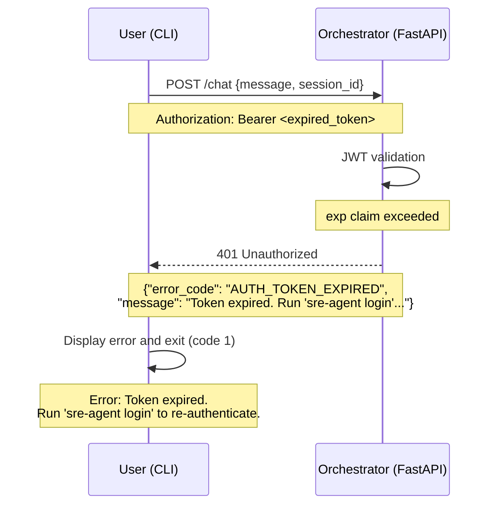
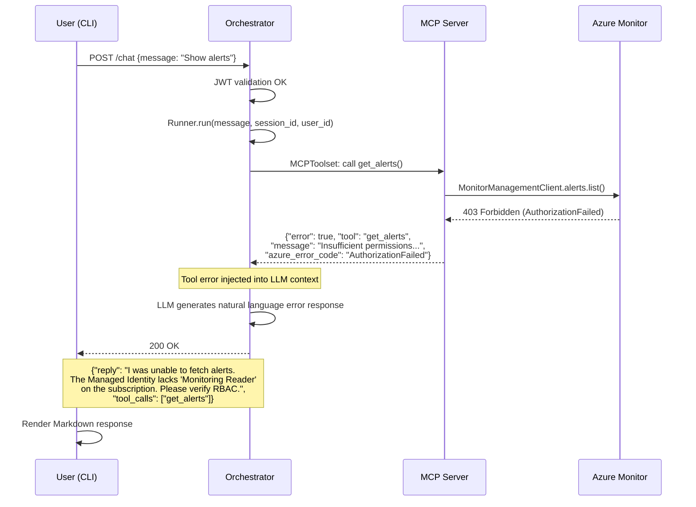
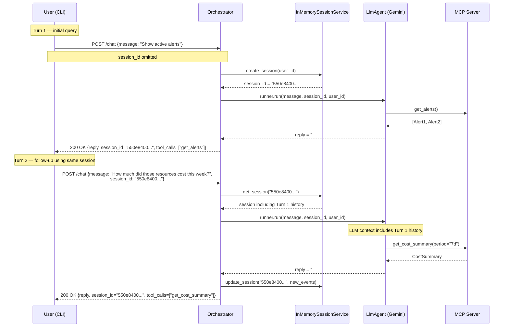
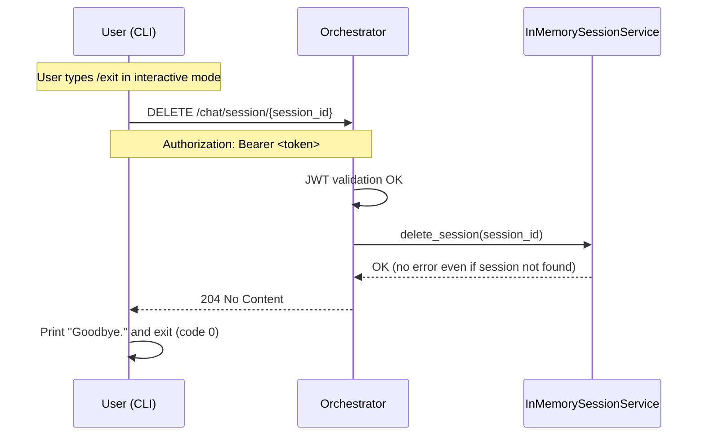
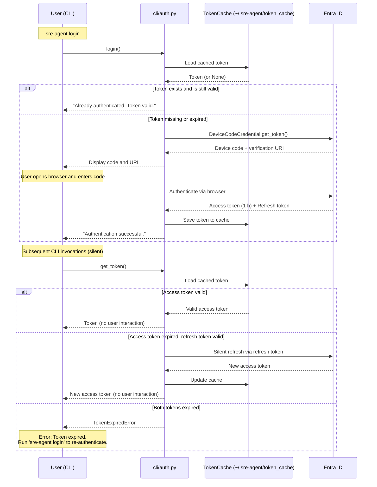

# Technical Specification

This document supplements [docs/design.md](design.md) and [docs/requirements.md](requirements.md) with implementation-level specifications. Architecture overview, deployment strategy, and phase planning are covered in those documents — refer to them rather than repeating content here.

**Scope of this document:**
- Complete Pydantic data model field definitions
- Request / response JSON schemas and HTTP status codes for all endpoints
- Unified error response format and error code catalog
- MCP tool response structures with sample JSON
- CLI command options, arguments, and output formats
- Sequence diagrams covering error cases and multi-turn flows

---

## Table of Contents

1. [Pydantic Data Models](#1-pydantic-data-models)
2. [Orchestrator API Schema](#2-orchestrator-api-schema)
3. [MCP Tool Output Specification](#3-mcp-tool-output-specification)
4. [CLI Command Reference](#4-cli-command-reference)
5. [Sequence Diagrams](#5-sequence-diagrams)

---

## 1. Pydantic Data Models

### 1.1 Orchestrator API Models

#### `ChatRequest`

```python
class ChatRequest(BaseModel):
    message: str                    # Required. User's input text.
    session_id: UUID | None = None  # Omit to start a new session; server generates a UUID.
```

> `user_id` is never accepted from the client. It is extracted from the JWT `oid` claim.

#### `ChatResponse`

```python
class ChatResponse(BaseModel):
    reply: str                      # Required. Agent's Markdown-formatted response.
    session_id: UUID                # Required. Session ID used or newly created.
    tool_calls: list[str] = []      # Ordered list of MCP tool names called in this turn.
```

#### `Message`

```python
class Message(BaseModel):
    role: Literal["user", "model"]  # Required. Matches Google ADK role names.
    content: str                    # Required. Plain text for user; Markdown for model.
    timestamp: datetime             # Required. UTC ISO 8601.
    tool_calls: list[str] = []      # Tools called in this turn (model role only).
```

#### `HistoryResponse`

```python
class HistoryResponse(BaseModel):
    session_id: UUID                # Required.
    messages: list[Message]         # Required. Chronological order.
    created_at: datetime            # Required. Session creation time (UTC).
    updated_at: datetime            # Required. Last update time (UTC).
```

#### `HealthResponse`

```python
class HealthResponse(BaseModel):
    status: Literal["ok", "degraded"]                # Required.
    mcp_server: Literal["reachable", "unreachable"]  # Required. Result of MCP connectivity check.
    version: str                                     # Required. e.g. "0.1.0"
    timestamp: datetime                              # Required. UTC.
```

> `/health` always returns HTTP 200. Use `status: "degraded"` to signal MCP Server unavailability.

#### `ErrorResponse`

```python
class ErrorResponse(BaseModel):
    error_code: str                 # Required. e.g. "AUTH_TOKEN_EXPIRED"
    message: str                    # Required. Human-readable explanation (English).
    detail: str | None = None       # Optional. Additional debug information.
    request_id: UUID | None = None  # Optional. Reserved for future log tracing.
```

---

### 1.2 MCP Tool Output Models

FastMCP serializes tool return values as `dict` / `list[dict]`. The following are logical schemas.

#### `Alert`

```python
class Alert(BaseModel):
    id: str              # Azure Alert Rule Resource ID.
    name: str            # Alert rule name.
    severity: int        # 0=Critical, 1=Error, 2=Warning, 3=Informational, 4=Verbose.
    severity_label: str  # "Critical" | "Error" | "Warning" | "Informational" | "Verbose".
    state: str           # "New" | "Acknowledged" | "Closed".
    resource_id: str     # Azure Resource ID of the affected resource.
    resource_group: str  # Resource group name.
    resource_type: str   # e.g. "microsoft.web/sites"
    description: str     # Alert description (may be empty string).
    fired_at: str        # UTC ISO 8601 string.
    resolved_at: str | None  # Resolution time; null if still active.
```

> `severity_label` is derived in the tool implementation via `{0: "Critical", 1: "Error", 2: "Warning", 3: "Informational", 4: "Verbose"}`.

#### `CostSummary`

```python
class CostSummary(BaseModel):
    period: str                              # "today" | "7d" | "30d"
    start_date: str                          # Period start date, YYYY-MM-DD.
    end_date: str                            # Period end date, YYYY-MM-DD.
    total_cost: float                        # Total cost for the period.
    currency: str                            # Currency code. e.g. "JPY" | "USD"
    by_service: list[ServiceCost]            # Per-service breakdown, sorted descending by cost.
    by_resource_group: list[ResourceGroupCost]  # Per-resource-group breakdown, sorted descending.

class ServiceCost(BaseModel):
    service_name: str  # e.g. "Azure App Service"
    cost: float
    currency: str

class ResourceGroupCost(BaseModel):
    resource_group: str
    cost: float
    currency: str
```

#### `ToolError`

```python
class ToolError(BaseModel):
    error: Literal[True]                 # Always True; used as an error flag.
    tool: str                            # Tool name.
    message: str                         # Error description for the LLM to relay naturally.
    azure_error_code: str | None = None  # Azure API error code when available.
```

---

### 1.3 CLI Settings Model

```python
class CLIConfig(BaseSettings):
    orchestrator_url: str                                          # Required. ORCHESTRATOR_URL
    entra_tenant_id: str | None = None                            # ENTRA_TENANT_ID
    entra_app_client_id: str | None = None                        # ENTRA_APP_CLIENT_ID
    skip_auth: bool = False                                       # SKIP_AUTH
    token_cache_path: Path = Path("~/.sre-agent/token_cache")    # Token cache location.
```

---

## 2. Orchestrator API Schema

### 2.1 POST /chat

**Request**

```http
POST /chat HTTP/1.1
Authorization: Bearer eyJ...
Content-Type: application/json

{
  "message": "Are there any active alerts?",
  "session_id": "550e8400-e29b-41d4-a716-446655440000"
}
```

First request (omitting `session_id`):

```json
{
  "message": "Show me current alerts"
}
```

**Response 200 OK**

```json
{
  "reply": "## Active Alerts (2)\n\n| Severity | Resource | Description |\n|---|---|---|\n| **Critical** | `func-app-prod` | CPU usage > 95% for 5 minutes |\n| **Warning** | `storage-account-01` | Throttling detected |\n\nRecommendation: Check the `func-app-prod` scaling configuration.",
  "session_id": "550e8400-e29b-41d4-a716-446655440000",
  "tool_calls": ["get_alerts"]
}
```

---

### 2.2 GET /chat/history/{session_id}

**Response 200 OK**

```json
{
  "session_id": "550e8400-e29b-41d4-a716-446655440000",
  "messages": [
    {
      "role": "user",
      "content": "Are there any active alerts?",
      "timestamp": "2026-04-01T09:00:00Z",
      "tool_calls": []
    },
    {
      "role": "model",
      "content": "## Active Alerts (2)\n\n...",
      "timestamp": "2026-04-01T09:00:03Z",
      "tool_calls": ["get_alerts"]
    }
  ],
  "created_at": "2026-04-01T09:00:00Z",
  "updated_at": "2026-04-01T09:00:03Z"
}
```

---

### 2.3 DELETE /chat/session/{session_id}

**Response 204 No Content** (empty body)

Returns 204 even when the session does not exist (idempotent).

---

### 2.4 GET /health

**Response 200 OK** (healthy)

```json
{
  "status": "ok",
  "mcp_server": "reachable",
  "version": "0.1.0",
  "timestamp": "2026-04-01T09:00:00Z"
}
```

**Response 200 OK** (MCP Server unavailable)

```json
{
  "status": "degraded",
  "mcp_server": "unreachable",
  "version": "0.1.0",
  "timestamp": "2026-04-01T09:00:00Z"
}
```

---

### 2.5 HTTP Status Code Reference

| Endpoint | Method | Code | Condition |
|---|---|---|---|
| `/chat` | POST | 200 | Success |
| `/chat` | POST | 400 | Invalid request body |
| `/chat` | POST | 401 | Authentication failure (missing, expired, or invalid token) |
| `/chat` | POST | 422 | Pydantic validation error (FastAPI default) |
| `/chat` | POST | 500 | Orchestrator internal error (includes ADK / LLM errors) |
| `/chat` | POST | 502 | MCP Server unreachable |
| `/chat/history/{id}` | GET | 200 | Success |
| `/chat/history/{id}` | GET | 401 | Authentication failure |
| `/chat/history/{id}` | GET | 404 | Session not found |
| `/chat/session/{id}` | DELETE | 204 | Deleted (or did not exist) |
| `/chat/session/{id}` | DELETE | 401 | Authentication failure |
| `/health` | GET | 200 | Always 200; use body `status` field to determine health |

---

### 2.6 Error Response Format and Error Code Catalog

All error responses use the `ErrorResponse` schema.

```json
{
  "error_code": "AUTH_TOKEN_EXPIRED",
  "message": "The access token has expired. Please run 'sre-agent login' to re-authenticate.",
  "detail": "JWT exp claim: 2026-04-01T08:00:00Z",
  "request_id": null
}
```

#### Error Code Catalog (MVP)

| Error Code | HTTP | Description |
|---|---|---|
| `AUTH_TOKEN_MISSING` | 401 | `Authorization` header absent |
| `AUTH_TOKEN_EXPIRED` | 401 | JWT `exp` claim exceeded |
| `AUTH_TOKEN_INVALID` | 401 | JWT signature verification failed |
| `AUTH_TOKEN_WRONG_AUDIENCE` | 401 | `aud` claim does not match `api://{client_id}` |
| `VALIDATION_INVALID_SESSION_ID` | 400 | `session_id` is not a valid UUID |
| `VALIDATION_MESSAGE_EMPTY` | 400 | `message` is empty or whitespace only |
| `SESSION_NOT_FOUND` | 404 | No session with the given `session_id` |
| `AGENT_LLM_ERROR` | 500 | Gemini API returned an error |
| `MCP_SERVER_UNREACHABLE` | 502 | HTTP connection to MCP Server failed |
| `INTERNAL_UNEXPECTED_ERROR` | 500 | Any other unexpected error |

---

## 3. MCP Tool Output Specification

### 3.1 get_alerts

**Input Parameters**

| Parameter | Type | Required | Description |
|---|---|---|---|
| `resource_group` | `str` | No | Filter by resource group name |
| `severity` | `int` (0–4) | No | Filter by severity level |

**Success Response (`list[dict]`)**

```json
[
  {
    "id": "/subscriptions/xxxxxxxx-xxxx-xxxx-xxxx-xxxxxxxxxxxx/providers/Microsoft.AlertsManagement/alerts/aaaaaa",
    "name": "High CPU on func-app-prod",
    "severity": 0,
    "severity_label": "Critical",
    "state": "New",
    "resource_id": "/subscriptions/xxxxxxxx-xxxx-xxxx-xxxx-xxxxxxxxxxxx/resourceGroups/rg-prod/providers/Microsoft.Web/sites/func-app-prod",
    "resource_group": "rg-prod",
    "resource_type": "microsoft.web/sites",
    "description": "CPU usage exceeded 95% threshold for 5 consecutive minutes.",
    "fired_at": "2026-04-01T08:45:00Z",
    "resolved_at": null
  },
  {
    "id": "/subscriptions/xxxxxxxx-xxxx-xxxx-xxxx-xxxxxxxxxxxx/providers/Microsoft.AlertsManagement/alerts/bbbbbb",
    "name": "Storage Throttling Detected",
    "severity": 2,
    "severity_label": "Warning",
    "state": "New",
    "resource_id": "/subscriptions/xxxxxxxx-xxxx-xxxx-xxxx-xxxxxxxxxxxx/resourceGroups/rg-prod/providers/Microsoft.Storage/storageAccounts/storageaccount01",
    "resource_group": "rg-prod",
    "resource_type": "microsoft.storage/storageaccounts",
    "description": "Storage account is being throttled due to exceeding IOPS limits.",
    "fired_at": "2026-04-01T07:30:00Z",
    "resolved_at": null
  }
]
```

Returns an empty array `[]` when no active alerts exist.

---

### 3.2 get_cost_summary

**Input Parameters**

| Parameter | Type | Required | Values | Description |
|---|---|---|---|---|
| `period` | `str` | No | `"today"`, `"7d"`, `"30d"` | Aggregation period (default: `"7d"`) |

**Success Response (`dict`)** — example for `period="7d"`

```json
{
  "period": "7d",
  "start_date": "2026-03-25",
  "end_date": "2026-04-01",
  "total_cost": 12453.80,
  "currency": "JPY",
  "by_service": [
    { "service_name": "Azure App Service", "cost": 5230.50, "currency": "JPY" },
    { "service_name": "Azure Functions",   "cost": 3120.00, "currency": "JPY" },
    { "service_name": "Azure Storage",     "cost": 2103.30, "currency": "JPY" },
    { "service_name": "Others",            "cost": 2000.00, "currency": "JPY" }
  ],
  "by_resource_group": [
    { "resource_group": "rg-prod",    "cost": 10250.80, "currency": "JPY" },
    { "resource_group": "rg-staging", "cost":  2203.00, "currency": "JPY" }
  ]
}
```

For `period="today"`, `start_date` and `end_date` are the same date.

---

### 3.3 Tool Error Format

When an Azure API call fails:

```json
{
  "error": true,
  "tool": "get_alerts",
  "message": "Failed to fetch alerts: Insufficient permissions. The Managed Identity does not have 'Monitoring Reader' role on subscription xxxxxxxx-xxxx-xxxx-xxxx-xxxxxxxxxxxx.",
  "azure_error_code": "AuthorizationFailed"
}
```

> Tool errors are injected into the LLM context; the agent relays them to the user in natural language. The HTTP response is still 200 OK. Only when the MCP Server itself is unreachable does the Orchestrator return 502.

---

## 4. CLI Command Reference

### 4.1 sre-agent (default)

No arguments or options. Starts interactive mode. Equivalent to `sre-agent chat`.

**Startup output**

```
Session: 550e8400-e29b-41d4-a716-446655440000
SRE Agent ready. Type /help for commands.

>
```

---

### 4.2 sre-agent login

```
sre-agent login
```

Authenticates with Entra ID via Device Code Flow.

**Normal output**

```
To sign in, use a web browser to open:
  https://microsoft.com/devicelogin
Enter code: ABCD-EFGH

Authentication successful. Token cached at ~/.sre-agent/token_cache
```

When `SKIP_AUTH=true`: prints `Auth skipped (SKIP_AUTH=true)` and exits immediately.

---

### 4.3 sre-agent chat

Same behaviour as `sre-agent`. Starts interactive mode.

---

### 4.4 sre-agent alerts

```
sre-agent alerts [OPTIONS]
```

| Option | Type | Default | Description |
|---|---|---|---|
| `--resource-group TEXT` | str | None | Filter by resource group name |
| `--severity INTEGER` | int (0–4) | None | Filter by severity (0=Critical) |

Agent response is rendered as Markdown via `rich`.

---

### 4.5 sre-agent cost

```
sre-agent cost [OPTIONS]
```

| Option | Type | Default | Description |
|---|---|---|---|
| `--period TEXT` | `"today"` \| `"7d"` \| `"30d"` | `"7d"` | Aggregation period |

Invalid `--period` value triggers a Click validation error and exits with code 2:

```
Error: Invalid value for '--period': 'monthly' is not one of 'today', '7d', '30d'.
```

---

### 4.6 Interactive Mode Slash Commands

| Command | Behaviour | Output |
|---|---|---|
| `/exit` | Exit interactive mode | `Goodbye.` |
| `/quit` | Alias for `/exit` | `Goodbye.` |
| `/help` | Show available commands | See below |
| `/session` | Display current session ID | `Session: 550e8400-e29b-41d4-a716-446655440000` |

`/help` output:

```
Available commands:
  /exit, /quit   Exit interactive mode
  /session       Show current session ID
  /help          Show this help
```

Unknown slash command (does not exit):

```
Unknown command '/foo'. Type /help for available commands.
```

---

### 4.7 CLI Error Display

| Situation | Message | Exit Code |
|---|---|---|
| Not authenticated (401) | `Error: Authentication required. Run 'sre-agent login' to authenticate.` | 1 |
| Token expired (401) | `Error: Token expired. Run 'sre-agent login' to re-authenticate.` | 1 |
| Orchestrator unreachable | `Error: Cannot reach orchestrator at {ORCHESTRATOR_URL}. Check connection.` | 1 |
| MCP Server unavailable (502) | `Error: Azure tools are currently unavailable. (MCP_SERVER_UNREACHABLE)` | 1 |
| Internal server error (500) | `Error: Internal server error. (INTERNAL_UNEXPECTED_ERROR)` | 1 |
| Unknown slash command | `Unknown command '/foo'. Type /help for available commands.` | 0 (continues) |

One-shot commands (`alerts`, `cost`) exit with code 1 on error. Interactive mode displays the error message and waits for the next input rather than terminating.

---

## 5. Sequence Diagrams

### 5.1 Authentication Failure (JWT Validation Error)



---

### 5.2 Azure API Failure (Tool Error — Returned as 200 OK)



---

### 5.3 Multi-Turn Conversation



---

### 5.4 Session Cleanup (/exit)



> The CLI always issues `DELETE /chat/session/{session_id}` before terminating on `/exit`. Returns 204 even if the session does not exist (idempotent).

---

### 5.5 Token Refresh Flow (Device Code Flow)



> `azure-identity`'s `DeviceCodeCredential` handles silent token refresh internally. The CLI only manages cache load/save; refresh logic is fully delegated to `azure-identity`.
